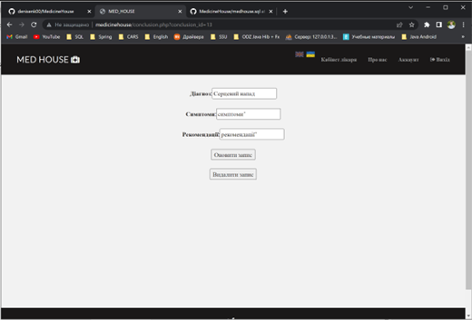

# MedicineHouse

Web-system for keeping records of patients and involving new ones.
Provides information about clinic, locations, contacts, doctors.
Patient have ability to create own profile, there will be stored his medical card, where he can see list of all records (date, diagnosis, prescriptions). Also patient can change information about himself - edit profile.
Doctor can manipulate records in patients medical card (CRUD)
Localization of interface is availble

## Technology stack
Php 8.0, MySQL, HTML, Bootstrap, Google Fonts, JavaScript, jQuery

Default credentials: sysadm/medhouse

## Screenshots

### Not-authenticated user

### sysadm

### Authenticated user

## Patient

### Doctor

